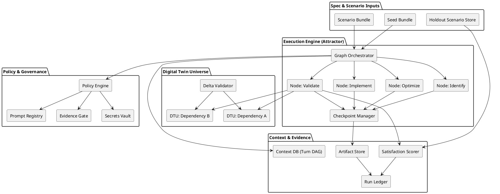
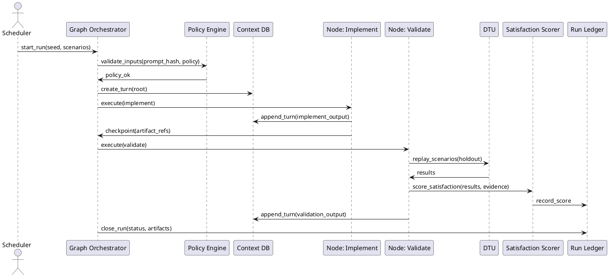

# SPEC-1 Software Factory Platform — Method (MVP Architecture)

## Summit Readiness Assertion (Preemptive Escalation)
This Method is bound to the **Summit Readiness Assertion** and inherits absolute readiness
requirements, enforced via the Constitution and Meta-Governance controls.
See: `docs/SUMMIT_READINESS_ASSERTION.md`, `docs/governance/CONSTITUTION.md`,
`docs/governance/META_GOVERNANCE.md`.

## High-Level Summary & 1st–27th Order Implications

**Summary**: The MVP is a non-interactive, spec-and-scenario driven software factory that executes
as a deterministic, graph-structured SDLC pipeline. It produces a mergeable change set and an
evidence bundle (satisfaction scores + artifacts) while preserving provenance, replay, and
security isolation. The system is intentionally constrained to governance-first operation with
explicit policy boundaries and deterministic replay semantics.

### Implications (1st–27th Order)
1. **Input determinism**: Every run must be fully defined by a seed + scenario bundle.
2. **Scenario primacy**: Scenarios replace tests as the primary evaluation artifact.
3. **Holdout enforcement**: Scenario bundles must include holdout sets for reward-hacking defense.
4. **Satisfaction scoring**: Success is probabilistic with LLM-as-judge + structured signals.
5. **Opaque correctness**: Code is evaluated via externally observable behavior only.
6. **DTU standardization**: Deterministic twins become mandatory for key dependencies.
7. **Replay invariants**: Replays must be byte-for-byte reproducible under identical inputs.
8. **Graph pipeline**: SDLC execution is a graph, not a linear script.
9. **Resumability**: Pipeline nodes must checkpoint for recovery and replay.
10. **Turn DAG**: Every agent interaction persists into a turn DAG for branching and audit.
11. **Provenance certainty**: Every artifact carries lineage to prompt + tool + inputs.
12. **Policy enforcement**: Governance becomes a runtime gate, not a retrospective audit.
13. **Isolation mandates**: Secrets and execution are isolated per node.
14. **Evidence-first operations**: Outputs are measured by evidence bundles.
15. **Cost visibility**: Token usage becomes a first-class metric and guardrail.
16. **Scenario coverage**: Scenario design becomes the primary product risk surface.
17. **DTU fidelity race**: DTU fidelity must converge against real dependency deltas.
18. **Agent specialization**: Nodes can be model-routed by cost/accuracy budgets.
19. **Observability hooks**: Every node emits structured telemetry and run metrics.
20. **Human approval shift**: Humans approve outcomes, not code diffs.
21. **Change isolation**: Feature work is bounded to policy-allowed scopes.
22. **Rollback precision**: Every run includes deterministic rollback instructions.
23. **Governed exceptions**: Legacy bypasses become explicit governed exceptions.
24. **Authority alignment**: Artifacts must reference canonical definitions and authority files.
25. **Prompt integrity**: Every task references a registered prompt hash.
26. **Audit elevation**: Auditability is a release gate, not a post-process.
27. **Ecosystem lockstep**: The factory enforces ecosystem-wide consistency by design.

## Method (MVP Architecture)

### Component Diagram (PlantUML)


### Runtime Sequence (PlantUML)


## Minimal Schemas

### Scenario Store (JSON)
```json
{
  "scenario_id": "SCN-0001",
  "version": "v1",
  "category": "holdout",
  "inputs": {
    "seed_ref": "seed://bundle/2026-02-07",
    "params": {"run_mode": "non-interactive"}
  },
  "expected_signals": {
    "assertions": ["no_error", "output_schema_valid"],
    "diff_rules": ["no_regression", "no_secret_leak"],
    "log_signals": ["policy_ok", "dtu_replay_ok"]
  },
  "evidence_budget": {
    "max_steps": 200,
    "max_tokens": 200000,
    "max_duration_seconds": 3600
  },
  "immutability": {
    "checksum": "sha256:...",
    "signed_by": "scenario-governance"
  }
}
```

### Run Ledger (JSON)
```json
{
  "run_id": "RUN-2026-02-07-0001",
  "prompt_ref": {
    "id": "spec-1-software-factory-method",
    "version": "v1",
    "sha256": "<registered>"
  },
  "status": "completed",
  "inputs": {
    "seed_bundle": "seed://bundle/2026-02-07",
    "scenario_bundle": "scenario://bundle/2026-02-07"
  },
  "artifacts": ["artifact://evidence/run-0001.zip"],
  "satisfaction": {
    "score": 0.92,
    "judge": "llm-judge-vX",
    "signals": {"assertions": 12, "diffs": 0, "policy_violations": 0}
  },
  "provenance": {
    "turn_dag_ref": "cxdb://turns/RUN-2026-02-07-0001",
    "toolchain": ["git", "runner", "policy_engine"],
    "immutability": "log://immutable/RUN-2026-02-07-0001"
  }
}
```

### DTU Twin (JSON)
```json
{
  "twin_id": "DTU-NEO4J-5X",
  "source_dependency": "neo4j@5.x",
  "fidelity": {
    "parity_score": 0.98,
    "delta_tests": ["DTU-DELTA-001", "DTU-DELTA-002"],
    "last_validated": "2026-02-07T00:00:00Z"
  },
  "determinism": {
    "seeded": true,
    "replayable": true,
    "config_hash": "sha256:..."
  },
  "interfaces": {
    "protocol": "bolt",
    "endpoints": ["dtu://neo4j-5x"]
  }
}
```

### Context DB (Turn DAG) (JSON)
```json
{
  "turn_id": "TURN-0001",
  "run_id": "RUN-2026-02-07-0001",
  "parent_turn_ids": ["TURN-ROOT"],
  "timestamp": "2026-02-07T00:00:00Z",
  "agent": "codex",
  "prompt_hash": "<registered>",
  "tool_calls": [
    {
      "tool": "git",
      "input_hash": "sha256:...",
      "output_ref": "artifact://tool/git/turn-0001"
    }
  ],
  "artifacts": ["artifact://patches/turn-0001.diff"],
  "checksum": "sha256:..."
}
```

## Policy + Controls
- **Secrets Isolation**: Per-node ephemeral secrets via vault with automatic revocation.
- **Sandboxed Execution**: Each node runs in a constrained container with strict FS/network rules.
- **Provenance**: Immutable logs with prompt hash + tool call hashes.
- **Immutable Run Logs**: Append-only ledger for all run metadata and evidence.
- **Governed Exceptions**: Any bypass is a recorded, time-bounded exception with owner sign-off.

## Alignment & Authority Files
- **Authority**: `docs/SUMMIT_READINESS_ASSERTION.md`, `docs/governance/CONSTITUTION.md`,
  `docs/governance/META_GOVERNANCE.md` are canonical.
- **Force Alignment**: All artifacts must reference these authority files and the prompt registry.

## MAESTRO Threat-Model Alignment
- **MAESTRO Layers**: Foundation, Data, Agents, Tools, Infra, Observability, Security.
- **Threats Considered**: Prompt injection, tool abuse, data exfiltration, DTU poisoning,
  scenario reward-hacking, provenance tampering.
- **Mitigations**: Prompt hash enforcement, policy gate checks, DTU parity validation,
  evidence-budget enforcement, immutable run ledger, sandboxed tool execution.

**Finality**: The Method is complete and intentionally constrained to enforce deterministic,
policy-governed execution with evidence-first outcomes.
