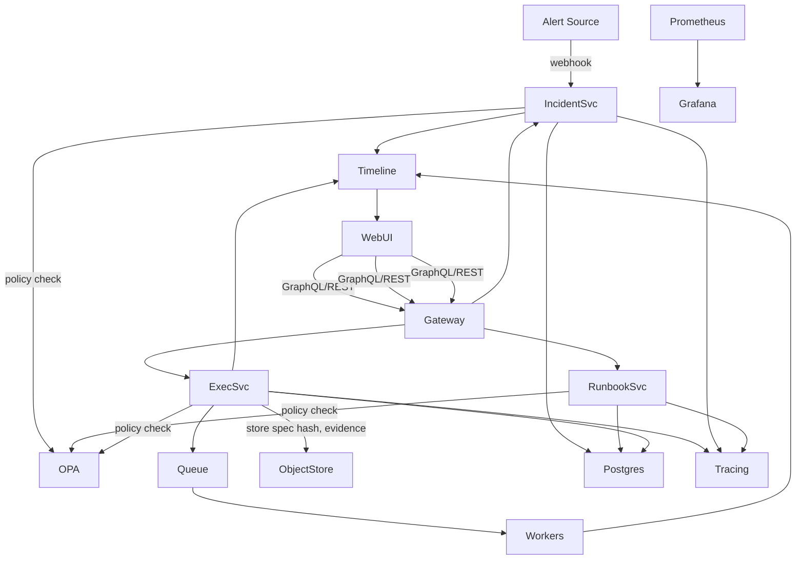
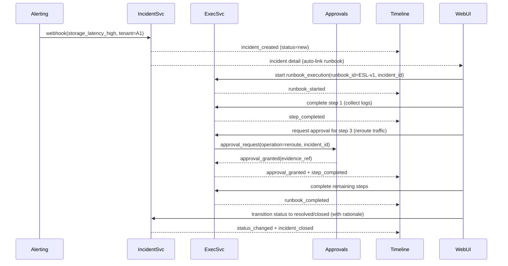

# Sprint 2: Incident & Runbook Center Deep Dive

## Objectives
- Land Incident & Runbook Center v1 with ABAC-aware visibility, approvals integration, and end-to-end provenance.
- Deliver a golden-path incident flow ("evidence storage latency") with runbook execution, approvals, and timeline receipts.
- Provide operational readiness: SLOs, dashboards, rollout toggles, and documentation for operators and admins.

## Architecture Overview
- **Services**: Incident API (CRUD + lifecycle), Runbook Catalog (versioned specs), Execution Engine, Approvals/Rationale Center (existing), Timeline/Event bus, Policy/OPA service, Telemetry (Prometheus/OpenTelemetry), Web (Switchboard UI).
- **Data stores**: Postgres (incidents, runbooks, executions, approvals linkage), Object storage (evidence bundles, runbook spec hashes), Redis/queue (execution workflow fan-out), Grafana/Prometheus (metrics), tracing backend (OTel/Tempo).
- **Integration fabric**: Kafka/NATS events for `incident.*` and `runbook.*` domain events feeding Timeline and audit receivers; Web uses GraphQL/REST gateway; policy decisions cached with OPA bundle + in-memory TTL.

## Domain Models (Postgres)
- **incident**: id (uuid), title, description, severity (`low|medium|high|critical`), status (`new|acknowledged|mitigating|monitoring|resolved|closed`), tenants (array), tags (jsonb), created_at, updated_at, sla_deadline, linked_alert_ids (jsonb), linked_runbook_ids (jsonb), linked_approval_ids (jsonb), owner, rationale_required (bool), severity_history (jsonb), provenance_hash.
- **runbook**: id (uuid), name, tags (jsonb), risk_level (`low|medium|high`), status (`draft|published`), version (int), spec (jsonb/yaml stored as jsonb), spec_hash, author, published_at, approvals (jsonb), usage_count.
- **runbook_execution**: id (uuid), runbook_id, runbook_version, incident_id (nullable), current_step, state (`pending|running|blocked|failed|aborted|completed`), inputs (jsonb), outputs (jsonb), step_states (jsonb with operator, timestamps, approval_ids), started_at, completed_at, provenance_hash.
- **timeline_event**: id, type (`incident_created`, `status_changed`, `runbook_started`, `step_completed`, `approval_granted`, etc.), actor, target_ids, payload, incident_id, runbook_execution_id, created_at, event_hash.

## APIs (Gateway/GraphQL or REST)
- `GET /incidents?severity&status&tenant&q` → paginated list with ABAC filter.
- `GET /incidents/{id}` → detail with linked alerts/runbooks/approvals/timeline slice.
- `POST /incidents` → create (policy: can_create_incident, ABAC tenant scope).
- `POST /incidents/{id}/transition` → {status, rationale?} (policy: per transition; rationale required for severity change or close without mitigation).
- `POST /incidents/{id}/severity` → {severity, rationale} (policy: can_change_severity).
- `POST /incidents/{id}/runbooks` → link runbook; `POST /incidents/{id}/owner` to assign.
- `GET /runbooks` | `GET /runbooks/{id}?version=` | `POST /runbooks` (draft) | `POST /runbooks/{id}/publish` (policy: can_publish_runbook; emits provenance bundle).
- `POST /runbooks/{id}/execute` → create runbook_execution; optional `incident_id`; initial event `runbook_started`.
- `POST /executions/{id}/steps/{step}/complete` → {outcome, evidence_ref, approval_ids?}; blocks if step risk=high and approval evidence missing.
- `POST /executions/{id}/abort` and `POST /executions/{id}/fail`.
- `GET /timeline?incident_id|runbook_execution_id` → ordered events.
- Simulation: `POST /policy/simulate` → {action, actor_attrs, resource} returns allow/deny + rationale.

## Golden Path: Evidence Storage Latency
- **Trigger**: Alert `storage_latency_high` from observability pipeline with tenant metadata → Incident auto-created (`severity=high`, status=`new`).
- **Triage Runbook**: `Evidence Storage Latency Triage v1` (steps below) auto-linked.
- **Approvals**: High-risk steps require approval referencing incident_id and tenant scope.

**Runbook Steps (ESL v1)**
1. Collect recent latency metrics & logs (low risk).
2. Verify tenant impact radius and current SLA (medium).
3. Reroute ingestion to standby shard (high → approval required; guard by ABAC & policy).
4. Trigger cache warmup for affected tenants (medium).
5. Monitor for 30 minutes; if stable, close mitigation (medium).
6. Post-incident evidence bundle (generate provenance chain) (medium).

## Policy & ABAC Highlights
- ABAC attributes: tenant_ids, environment, role, on-call rotation, clearance, risk tier.
- OPA packages: `incident.authz` (create/assign/escalate/close), `runbook.catalog` (create/publish), `runbook.execute` (per-step risk guard), `timeline.view` (scope filtering).
- Rules require rationale for severity changes and closing without mitigation; deny high-risk step completion without approval evidence matching incident & tenant.
- Policy bundle tests ≥90% coverage; simulation endpoint wired to Web UI for “can I do X?” prechecks.

## Observability & Provenance
- Metrics: `incidents_open_total`, `incidents_by_severity`, `incidents_mttr_seconds`, `incidents_mtta_seconds`, `runbook_executions_total`, `runbook_step_failure_rate`, `high_risk_step_approval_rate`, `runbook_execution_duration_seconds` (histogram), `policy_denials_total`.
- Tracing spans: alert ingestion → incident creation → UI interactions → runbook execution → approvals → closure; propagate incident_id/runbook_execution_id as trace attributes.
- Timeline evidence: every transition/runbook event stores hash chain with object storage references for approvals and runbook spec hashes.

## Operational Readiness & Feature Flags
- Feature flags: `incident_center_enabled`, `runbook_center_enabled` (gated in gateway + UI nav); rollout via config with per-tenant allowlist.
- Dashboards: Grafana “Operational Health” panel with cards for MTTR/MTTA, open incidents by severity, runbook success/failure, approval latency, per-tenant SLO view.
- Runbooks for SRE: “Incident service down/degraded”, “Runbook executions stuck”, “Timeline backlog drain”.

## Security & Compliance Notes
- No secrets in events; approvals evidence stored in object storage with signed URLs and TTL.
- Enforce TLS everywhere; CORS restricted; headers hardened via existing Helmet config.
- Audit trail immutable via hash chain; periodic export to long-term retention.

## Ticket Backlog (ready to create)
- **INC-101**: Implement Incident API CRUD + lifecycle transitions with ABAC filters and rationale enforcement.
- **INC-102**: UI: Incidents list/detail with filters, inline graph mini-view, quick actions (assign/escalate/link runbook).
- **INC-103**: Wire timeline component to incident lifecycle events.
- **RUN-201**: Runbook catalog CRUD + versioned publish flow with provenance bundle and policy checks.
- **RUN-202**: Runbook execution entity, step state machine, event emission, and blocked-on-approval logic.
- **RUN-203**: UI execution view (stepper, high-risk approval deeplink, inputs/outputs capture).
- **POL-301**: OPA policies for incident and runbook actions + simulation endpoint + ≥90% rule coverage.
- **OBS-401**: Metrics/tracing for incident + runbook lifecycle, Grafana dashboard, alerting SLOs.
- **OPS-501**: Feature flags, rollout plan, SRE runbooks for degraded services.
- **DOC-601**: Operator and admin docs: “Handle evidence storage latency” and “Define/publish runbooks safely”.

## Delivery/CI Notes
- Expand CI to run policy tests (OPA), backend Jest unit/integration, frontend Playwright smoke for new flows, and provenance hash consistency checks.
- PR gates: lint, typecheck, unit, integration, e2e (tagged), policy tests, schema drift check, SBOM regeneration on new services.
