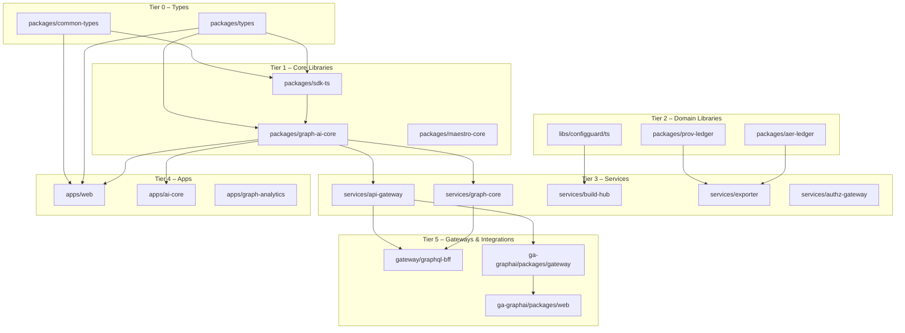

# Summit TypeScript Architecture

> A high-level map of the monorepo’s TypeScript build graph, layering, and workflow rules.

## 1) Overview
Summit is a composite TypeScript monorepo with 70+ projects wired through **project references**. The root `tsconfig.json` is the **solution** file; each package/app/service sets `"composite": true` and maintains its own unique `tsBuildInfoFile`. Builds are **incremental** via `tsc -b` and guarded in CI.

Key design goals:
- **Fast, deterministic builds** via references + per-project `.tsbuildinfo`.
- **Clear layering** to avoid cyclic deps and keep services/apps thin.
- **Typed linting only where it matters** (`src/**`), with tests/tools excluded from typed rules.
- **Automated reference management** (`scripts/gen-ts-references.mjs`).

## 2) Layering & Dependency Tiers

**Tier 0 – Runtime & Types**
- `packages/common-types`, `packages/types`, shared model packages
- No runtime infra, only types/consts. Emits declarations (`emitDeclarationOnly`).

**Tier 1 – Core Libraries**
- `packages/*-core`, DSLs, SDKs (`packages/sdk-ts`, `packages/graph-ai-core`, etc.)
- Pure libraries, no env coupling. May emit JS + d.ts.

**Tier 2 – Domain Libraries**
- Domain-specific libs (`packages/aer-ledger`, `packages/prov-ledger`, `libs/configguard/ts`, etc.)
- May reference Tier 0–1; must not import from services/apps.

**Tier 3 – Services**
- `services/*` (e.g., `graph-core`, `api-gateway`, `build-hub`, `authz-gateway`, `exporter`, `docling-svc`)
- Reference Tiers 0–2. Each service owns its runtime (Node) lib set.

**Tier 4 – Apps**
- Frontend apps (`apps/web`, `apps/ai-core`, `apps/graph-analytics`, `apps/ml-engine`, etc.)
- Depends on Tiers 0–2. No service-to-app imports.

**Tier 5 – Gateways & Integrations**
- `gateway/*`, `ga-graphai/*`, `ga-caseops/*` as boundary layers.
- May depend on Tiers 0–3; avoid upward edges to apps.

**Rules of thumb**
- Upward imports **forbidden** (e.g., service importing an app).
- Sideways imports across services discouraged—extract to a shared lib instead.
- Keep packages **acyclic**; if a cycle appears, split types to a Tier 0 package.

## 3) Build Graph (Mermaid)



> The diagram is illustrative; consult `tsconfig.json#references` for the authoritative set (currently 74 projects). New packages should target the **lowest viable tier** to maximize reuse.

## 4) Build & CI Rules
- **Solution build:** `tsc -b` from repo root; uses references order.
- **Unique build info:** Every project sets `tsBuildInfoFile` under its own `dist/` (or equivalent) to avoid collisions.
- **Frontends:** `lib: ["ES2022", "DOM", "DOM.Iterable"], jsx: "react-jsx"`
- **Backends:** `lib: ["ES2022"], types: ["node"]`
- **Next.js:** internal lint disabled during build; ESLint runs explicitly in CI.
- **CI:** path-filtered lint/typecheck; full-run if config files change.

## 5) Typed Linting Boundaries
- Typed rules restricted to `apps/**/src`, `packages/**/src`, `libs/**/src`, `services/**/src`.
- Tests, e2e, generated, build output are excluded from typed lint for speed.

## 6) Adding a New Package/App
1. Scaffold with `"composite": true`, unique `outDir` and `tsBuildInfoFile`.
2. Depend only on lower tiers; extract shared types to Tier 0 if needed.
3. Run `npm run ts:gen-refs` to add it to the solution graph.
4. Verify with `npm run ts:rebuild` and push—CI will gate regressions.

## 7) Operations & Maintenance
- **Nightly forced rebuild** detects stale artifacts.
- **Sanity workflow on PRs** runs `tsc -b` and `--dry` to catch broken references early.
- **Overrides** in `pnpm.overrides` pin critical toolchain versions.

## 8) Quick Commands
```bash
# Compile the entire graph incrementally
npm run typecheck

# Force a clean rebuild
npm run ts:rebuild

# Refresh project references
npm run ts:gen-refs

# Inspect what would change (no write)
npm run ts:gen-refs:dry
```

---
*This document is the living map for Summit’s TS architecture. Keep the Mermaid section aligned with major package moves, and always run `ts:gen-refs` after adding/removing projects.*