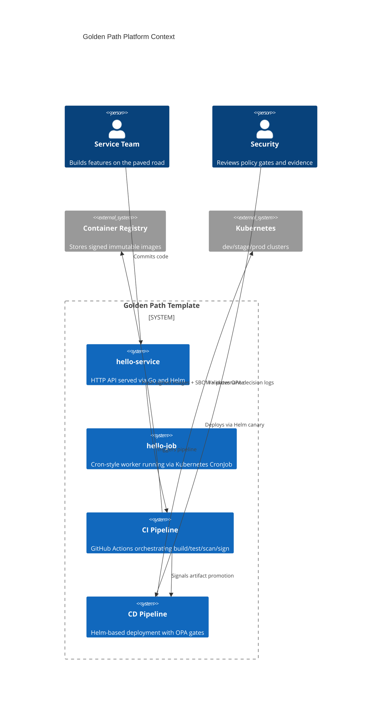

# C4 Context Diagram

```mermaid
C4Context
  title Golden Path Platform Context
  Person(dev, "Service Team", "Builds features on the paved road")
  Person(security, "Security", "Reviews policy gates and evidence")
  System_Boundary(cicd, "Golden Path Template") {
    System(service, "hello-service", "HTTP API served via Go and Helm")
    System(job, "hello-job", "Cron-style worker running via Kubernetes CronJob")
    System(ci, "CI Pipeline", "GitHub Actions orchestrating build/test/scan/sign")
    System(cd, "CD Pipeline", "Helm-based deployment with OPA gates")
  }
  System_Ext(registry, "Container Registry", "Stores signed immutable images")
  System_Ext(cluster, "Kubernetes", "dev/stage/prod clusters")
  Rel(dev, service, "Commits code")
  Rel(service, ci, "Triggers pipeline")
  Rel(ci, registry, "Push signed images + SBOM + provenance")
  Rel(ci, cd, "Signals artifact promotion")
  Rel(cd, cluster, "Deploys via Helm canary")
  Rel(security, cd, "Validates OPA decision logs")
```
